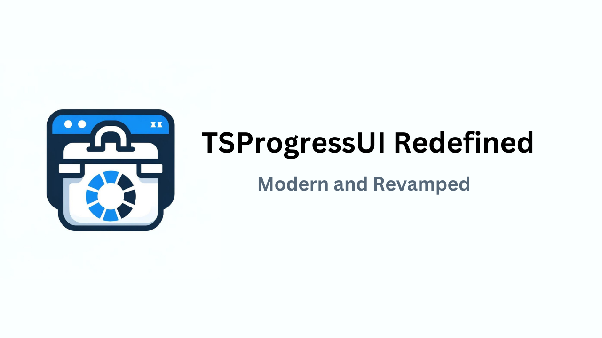

# TSProgressUI
TSProgressUI revolutionizes the way you track task sequences in the Microsoft Deployment Toolkit (MDT). Crafted with the power of Node.js and Electron.js, this sleek and innovative UI delivers real-time updates
with a visual flair. Elevate your deployment experience with a stunning, intuitive interface that makes monitoring progress not just easier, but downright enjoyable. Say goodbye to mundane progress bars and hello
to a whole new level of deployment efficiency!

## Table Of Contents
- [Introduction](#introduction)
- [Features](#features)
- [Installation](#installation)
- [Usage](#usage)
- [Contributing](#contributing)

## Introduction

Welcome to TSProgressUI, the ultimate solution for modernizing your task sequence tracking in the Microsoft Deployment Toolkit (MDT). Designed for IT professionals and tech enthusiasts alike, TSProgressUI combines
cutting-edge technology with sleek design to deliver a top-notch user experience.

### Why TSProgressUI?

MDT has been using old-style UI to track the progress of task sequences which often feel chunky and really boring at times. TSProgressUI changes that by offering a viusally appealing, real-time interface, and functional code that not only enhances your monitoring capabilities but also makes the process more enjoyable.

### Built With Modern Technologies
- [Node.JS]: Ensures a fast, scalable, and efficient runtime environment in combination with MDT PowerShell Module.
- [Electron.JS]: Powers the cross-platform desktop application bringing the performance and capabilties to MDT

## Features

### Key Features
- Real-Time Updates: Get immediate feedback on your deployment progress with dynamic live updates.
- Intuitive Design: A user-friendly interface that simplifies the monitoring process and minimizes the learning curve.
- Enhanced Visualization: TSProgressUI offers rich and enhanced representations of your task sequences
- Cross-Platform Compatbility: Any device that can be deployed with MDT can utilize TSProgressUI

### Upcoming Features
- Dynamic Computer Naming: Ability to rename the OSDComputerName variable during deployment before the computer joins the domain.
- Dynamic Domain Naming: Ability to change the domain in which the computer should join during deployment
- Network Printer Selection UI: Integrate Network Printer UI into the TSProgressUI Application
- MDT Wizard Integration: Integrate TSProgressUI with MDT Wizard and remove MDT's Default Wizard

## Installation
In order to use TSProgressUI, you will need to build the project yourself until I can figure out releasing the build myself. In order to build the project you will need Node.JS installed on any computer and then run these commands

### NPM install required modules
```
npm install
```

### Install electron-packager module
To build the project you need to install electron-packager by running

```
npm install --save-dev @electron/packager
```

and then cd into the project folder and run this command

```
npx @electron/packager . "TSProgressUI-Redefined" --platform=win32 --arch=x64
```
